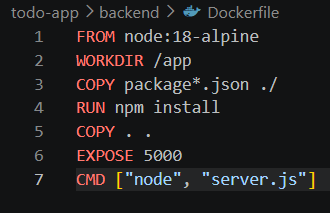
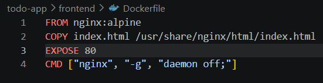
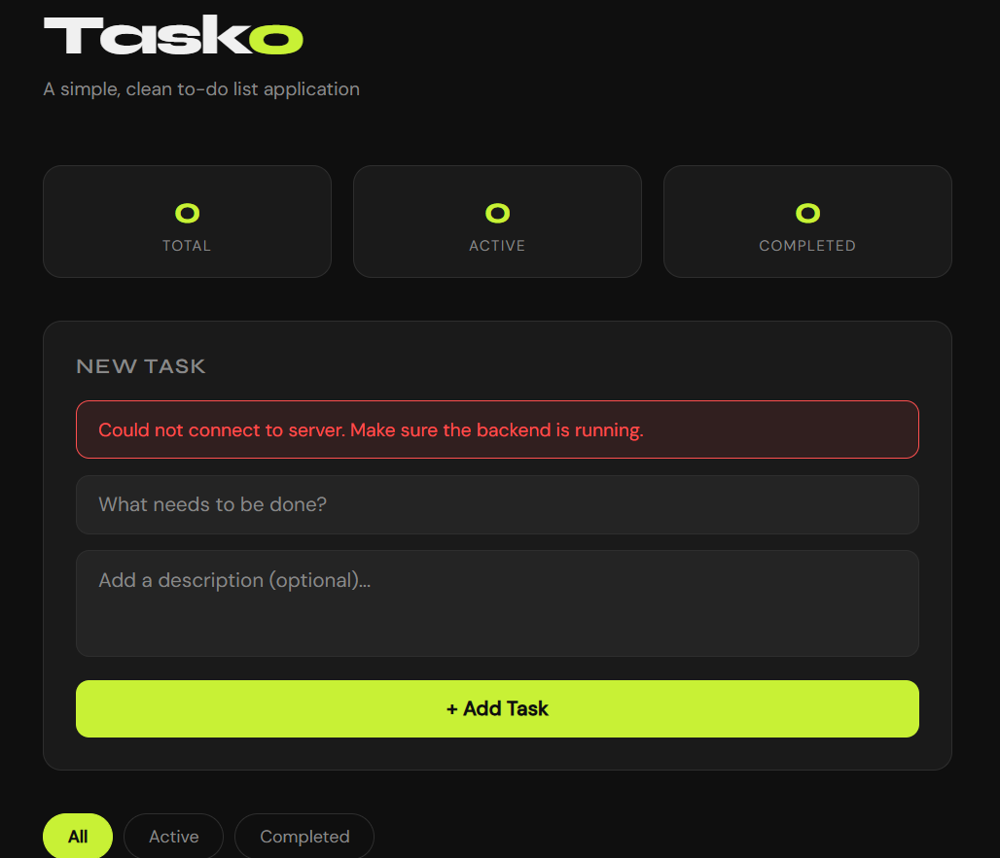
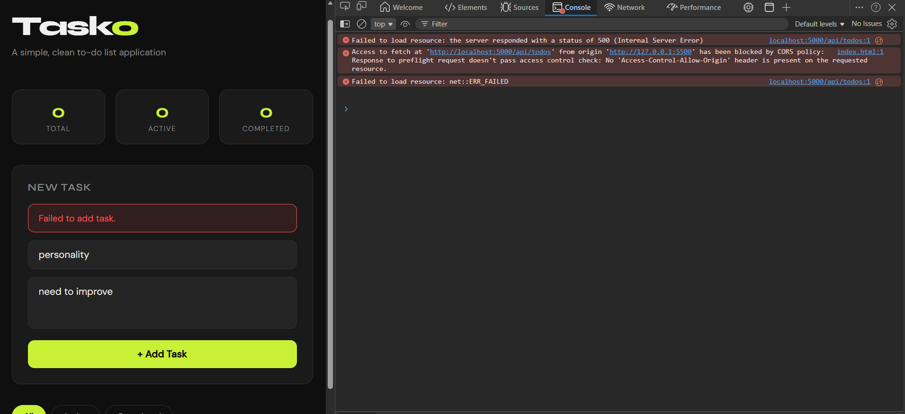
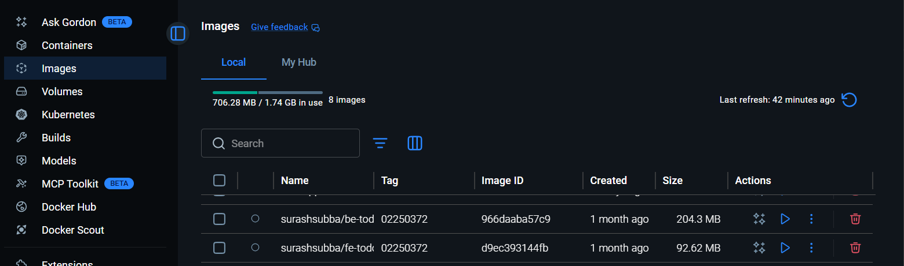
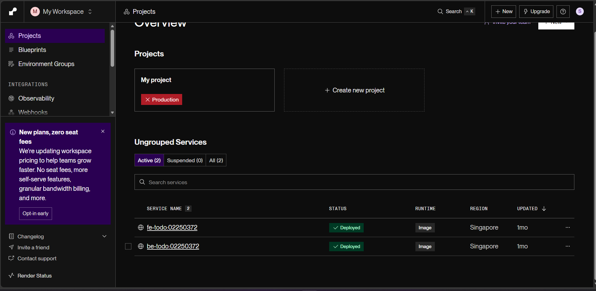
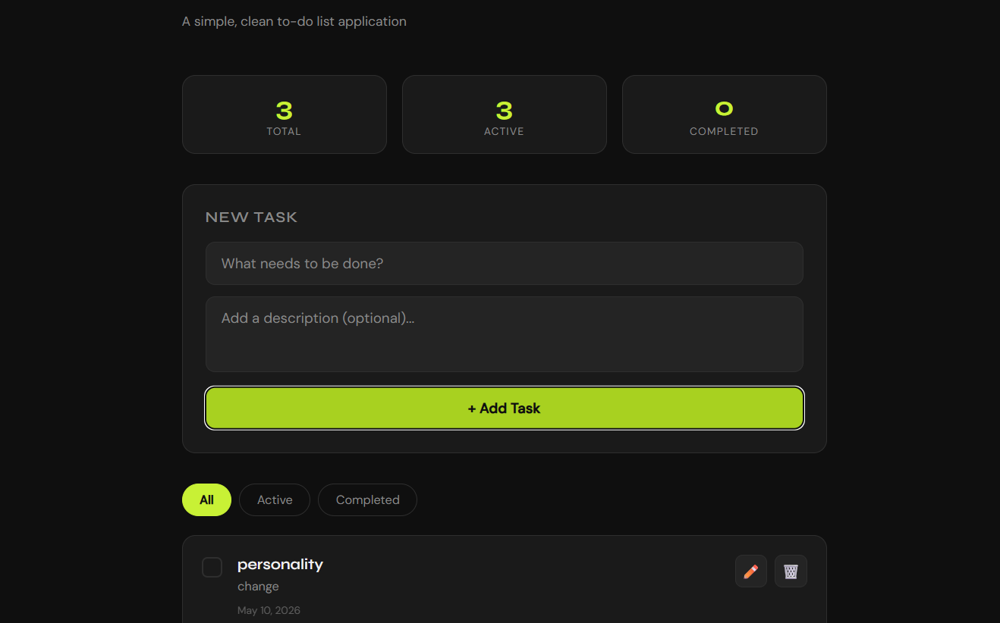
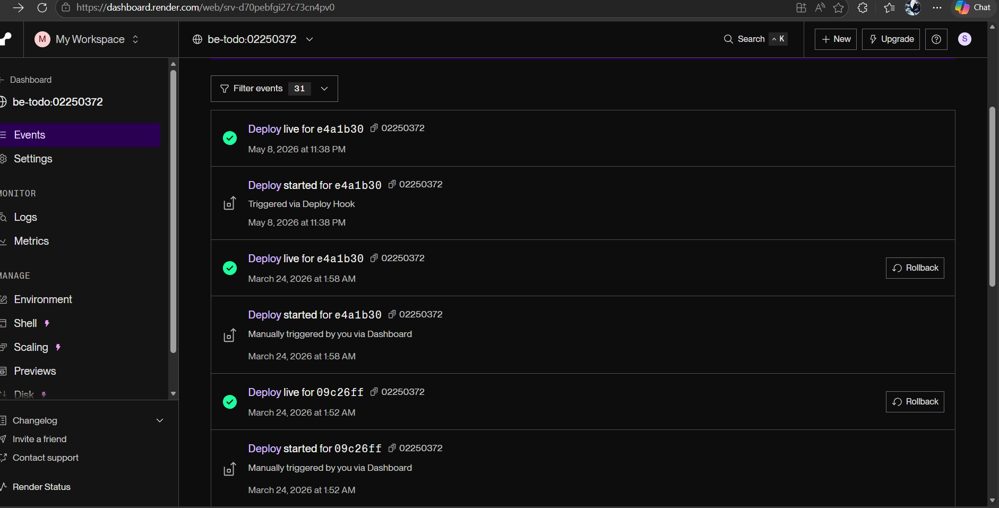

# Containerization and Deployment of To-Do Application (DSO101 - Assignment 1)

## Live Application URL

Frontend: https://fe-todo-02250372.onrender.com

Backend API https://be-todo-02250372.onrender.com

Database Connection Test: https://be-todo-02250372.onrender.com/api/todos


## Repository

**GitHub:** https://github.com/surashsubba/surashsubba_02250372_DSO101_A1

##  Project Overview
Tasko is a To-Do List web application in the fullstack:

Frontend:Plain HTML/CSS/JS (served from nginx Docker container)

Backend:Node.js+Express (REST API)

Database:PostgreSQL(hosted by Render)

This task mainly involves two forms of deploying and containerizing of this application using Docker and hosting on Render.com: 
Part A-manual deployment of images, 
Part B-automated deployment using render.yaml.

##  Tech Stack

| Technology | Purpose |
|------------|---------|
| Docker | Containerization |
| DockerHub | Image Registry |
| Render.com | Cloud Deployment |
| Node.js + Express | Backend API |
| PostgreSQL | Database |
| nginx | Frontend Static Server |

nginx is the waiter that delivers that file to whoever visits your website

## Project Structure

```bash
todo-app/
├── frontend/
│   ├── Dockerfile
│   ├── index.html
│   ├── .env
│   └── .env.production
├── backend/
│   ├── Dockerfile
│   ├── server.js
│   ├── package.json
│   ├── .env
│   └── .env.production
├── render.yaml
└── README.md
```


##  Step 0: Building the To-Do Application

### Frontend
Created a clean dark-themed UI named "Tasko" with plain HTML/CSS/JS. It includes:
- The ability to add, edit, and delete tasks
- Filters for All, Active, and Completed tasks
- Stats to display the total, active, and completed number of tasks
### Backend
Built a REST API using Node.js + Express with full CRUD:
- `GET /api/todos` — fetch all todos
- `POST /api/todos` — create todo
- `PUT /api/todos/:id` — update todo
- `DELETE /api/todos/:id` — delete todo

### Environment Variables
Configured `.env` for local and `.env.production` for production:

**Backend `.env`:**
```
DB_HOST=<dpg-d7v32djrjlhs73af48pg-a>
DB_NAME=tododb_iqc9
DB_USER=tododb_iqc9_user
DB_PASSWORD=<ZevKq34gple8Lfc5DNy0ID9GWWfgJGxF>
DB_PORT=5432
DB_SSL=true
PORT=5000
```

**Frontend `.env`:**

REACT_APP_API_URL = 'http://localhost:5000'; // local development

This was changed to the actual live back end url directly in the index html as the front end is raw html and not react.

const API_URL = 'https://be-todo-02250372.onrender.com';

The .env file should be ignored from the GitHub repo by including it in .gitignore.


##  Part A: Deploying a Pre-Built Docker Image

### Step 1: Write Dockerfiles

**Backend Dockerfile:**



**Frontend Dockerfile:**




### Step 2: Build and Push Images to DockerHub

Used student ID `02250372` as the image tag:

```bash
# Backend
docker build -t surashsubba/be-todo:02250372 .
docker push surashsubba/be-todo:02250372

# Frontend
docker build -t surashsubba/fe-todo:02250372 .
docker push surashsubba/fe-todo:02250372
```

### Step 3: Deploy on Render.com

**Backend Service:**
- Render → New + → Web Service → Existing Image from Docker Hub
- Image: `surashsubba/be-todo:02250372`
- Environment Variables:
```
DB_HOST=<dpg-d7v32djrjlhs73af48pg-a>
DB_NAME=tododb_iqc9
DB_USER=tododb_iqc9_user
DB_PASSWORD=<ZevKq34gple8Lfc5DNy0ID9GWWfgJGxF>
DB_PORT=5432
DB_SSL=true
PORT=5000
```

**Frontend Service:**
- Render → New + → Web Service → Existing Image from Docker Hub
- Image: `surashsubba/fe-todo:02250372`

**Database:**
- Render → New + → PostgreSQL
- Name: `todo-db`
- Region: Singapore
- Plan: Free


##  Part B: Automated Image Build and Deployment

Set up render.yaml to deploy multi services upon every git push:

```yaml
services:
  - type: web
    name: be-todo
    env: docker
    dockerfilePath: ./backend/Dockerfile
    envVars:
      - key: DB_HOST
        value: your-render-db-host
      - key: PORT
        value: 5000

  - type: web
    name: fe-todo
    env: docker
    dockerfilePath: ./frontend/Dockerfile
    envVars:
      - key: REACT_APP_API_URL
        value: https://be-todo.onrender.com
```

For every new commit made on main with git, Render automatically builds and deploys new Docker images for both services.

## Errors Encountered & How They Were Fixed

### Error 1: Accidentally Pushed `.env` to GitHub

**Problem:** Forgot to add `.env` to `.gitignore` — credentials were exposed on GitHub.

**Fix:** Added `.env` to `.gitignore` and removed it from the repository.

**Lesson Learned:** Always add `.env` to `.gitignore` before the first commit. Never commit credentials to GitHub.


### Error 2: Frontend Calling Wrong API URL

**Problem:** Frontend was calling the wrong port — backend connection failed.

**Fix:** Corrected `API_URL` in `index.html` to point to the right backend URL.




### Error 3: CORS Errors

**Problem:** Frontend and backend were on different origins causing CORS errors.

**Fix:** Added `cors` middleware to the backend:
```javascript
const cors = require('cors');
app.use(cors());
```




### Error 4: Port Mismatch

**Problem:** Dockerfile had `EXPOSE 5000` but Render wasn't detecting the port correctly.

**Fix:** Explicitly set `PORT=5000` in Render environment variables.


### Error 5: Wrong Region

**Problem:** Default region was Oregon — too far away causing latency.

**Fix:** Switched to Singapore region since it's geographically closer.

##  Learning Outcomes
- Learned how to write Dockerfiles for node applications and for nginx applications.
- Learned how to build, tag and push a Docker image into dockerhub.
- Used Render.com to deploy a multi-service application.
- Understood the significance of environment variables and the fact that '.env' should never be commited.
- Learned how to automatically deploy a multi-service application using 'render.yaml'.


##  Screenshots
 DockerHub Images
 

Render Services Deployed


Live Frontend (Tasko)


Backend API Response


##  License

This project is created for educational purposes as part of DSO101 assignment 4