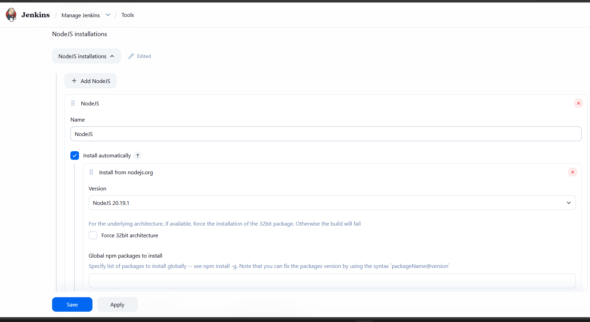
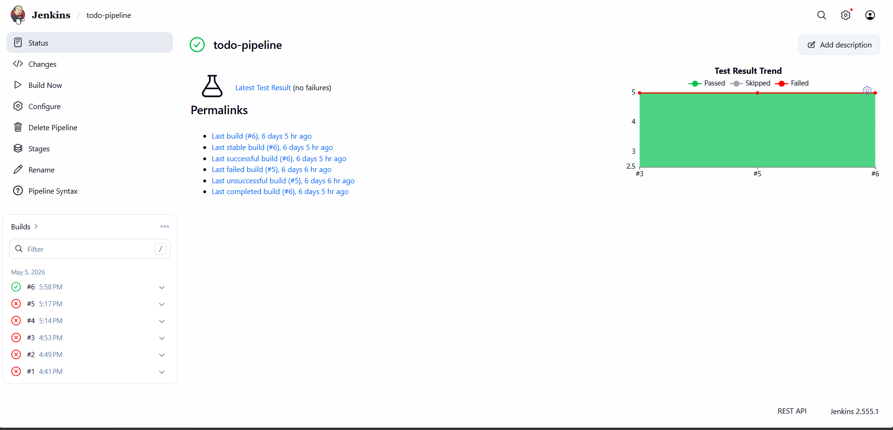
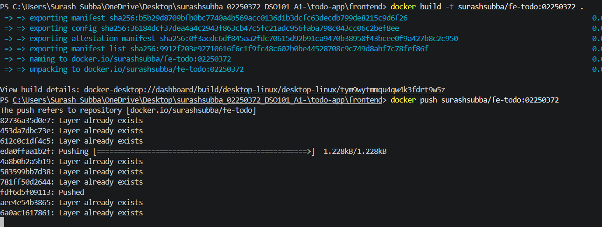

# DSO101 Assignment 2 – Jenkins CI/CD Pipeline

##  Repository
 
**GitHub:** https://github.com/Surash124/surashsubba_02250372_DSO101_A1-
 
---
 
##  Project Overview

For this assignment, theJenkins CI/CD Pipeline to build, test and deploy To-Do App (from Assignment 1). The pipeline automatically:
Clones source code from GitHub
Installs the dependencies
Runs unit tests with Jest
Builds & pushes docker image to docker hub
## Tools Used
- Jenkins (localhost:8080)
- Node.js + Jest + Supertest
- Docker + Docker Hub
- GitHub


## Pipeline Stages

| Stage | What it does |
|---|---|
| Checkout | Pulls code from GitHub |
| Install | Runs `npm install` in backend |
| Test | Runs Jest unit tests |
| Deploy | Builds and pushes Docker image to Docker Hub |


## Step 1 – Jenkins Setup

Installed Jenkins and configured the following plugins:
- NodeJS Plugin
- Pipeline
- Docker Pipeline
- GitHub Integration
- Config File Provider (required by NodeJS plugin)

Configured NodeJS 20.19.1 under **Manage Jenkins → Tools → NodeJS installations**.




## Step 2 – GitHub Credentials

Generated a GitHub Personal Access Token (PAT) with `repo` and `admin:repo_hook` permissions and added it to Jenkins as `github-creds`.


## Step 3 – Jest Tests

Created `server.test.js` with 5 tests covering the main API routes:
- `GET /` — API running check
- `GET /api/todos` — fetch all todos
- `POST /api/todos` — create todo
- `POST /api/todos` — fail if title missing
- `DELETE /api/todos/:id` — 404 if not found

Used `supertest` to simulate HTTP requests and mocked `pg` Pool so no real database is needed during testing.

Ran locally first to confirm all tests pass:




## Step 4 – Jenkinsfile

Created `Jenkinsfile` at the repo root with 4 stages. Full pipeline:
Checkout. install, test , and deploy

```groovy
pipeline {
  agent any
  tools {
    nodejs 'NodeJS'
  }
  stages {
    stage('Checkout') {
      steps {
        git branch: 'main',
            credentialsId: 'github-creds',
            url: 'https://github.com/Surash124/surashsubba_02250372_DSO101_A1-.git'
      }
    }
    stage('Install') {
      steps {
        dir('todo-app/backend') {
          bat 'npm install'
        }
      }
    }
    stage('Test') {
      steps {
        dir('todo-app/backend') {
          bat 'npm test'
        }
      }
      post {
        always {
          junit 'todo-app/backend/junit.xml'
        }
      }
    }
    stage('Deploy') {
      steps {
        script {
          docker.build('surashsubba/be-todo:latest', 'todo-app/backend')
          docker.withRegistry('https://registry.hub.docker.com', 'docker-hub-creds') {
            docker.image('surashsubba/be-todo:latest').push()
          }
        }
      }
    }
  }
}
```
Checkout: The stage checks out the latest source code from the desired git repository branch (main) for Jenkins to use.

Install: The stage changes into the todo-app/backend directory and runs npm install to fetch all of the project's dependencies.

Test: The stage runs your unit tests via the npm test command (running Jest) and then publishes the results found in junit.xml to the Jenkins UI.

Deploy: The stage finally uses docker to build an image of your application and push the image to your docker hub registry.


## Step 5 – Pipeline Configuration in Jenkins

1. Created a new Pipeline job called `todo-pipeline`
2. Set Definition to `Pipeline script from SCM`
3. Set SCM to Git with the GitHub repo URL
4. Set Script Path to `Jenkinsfile`

---

## Issues I ran into

- **NodeJS plugin failed to install** — missing `Config File Provider` dependency. Fixed by installing it separately first.

  

- **`sh` command not found** — Jenkinsfile had sh statements which are Linux-only. Jenkins was running on Windows therefore all the sh commands had to be replaced with bat commands.
  

- **Wrong GitHub repo URL in Jenkinsfile** — Used surashsubba,instead of Surash124, changed the  url and push again.

- **Docker build failed** — Dockerfile path was wrong, it was looking in repo root instead of `todo-app/backend`. Fixed by passing the path: `docker.build('...', 'todo-app/backend')`.

  

- **Docker push unauthorized** — Used docker hub account password, which did not work. so had to generate and use docker hub access token.

  


## Final Result

All 4 stages passed successfully:


Learning Outcomes
- Learned to setup Jenkins and how to install and configure Jenkins for node.js
- Learned how to create a multi-stage Jenkinsfile: Checkout, Install, Test, and Deploy
- Learned to create unit tests using Jest and Supertest
- Learned to mock a database connection during the unit tests without needing a real DB
- Learned how to difference the sh and bat script in jenkins
- Learned how to work with Jenkins Credentials system in order to securely store secrets such as GitHub Personal Access Tokens and Docker Hub credentials.
- Added Docker to a Jenkins job so images can be automatically built and pushed to a remote registry.

**license**
This project is created for educational purposes as part of DSO101 assignment 2